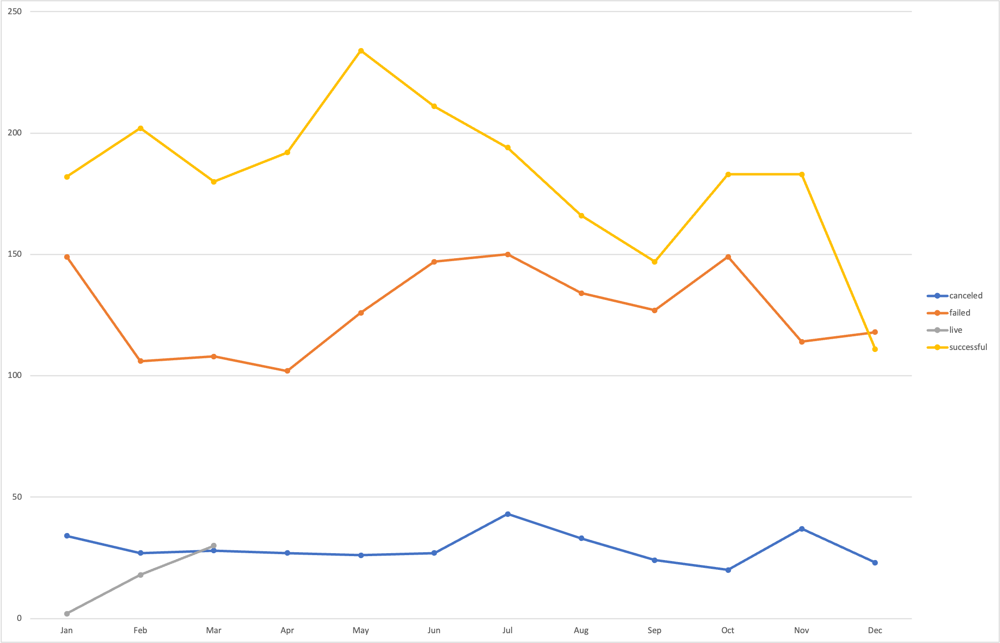
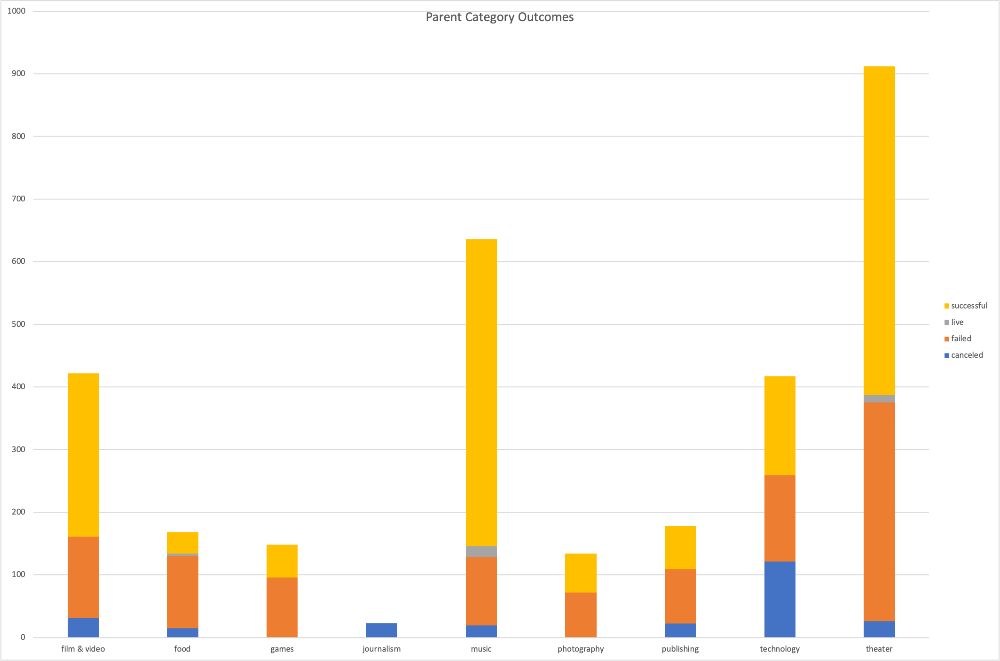

# An Analysis of Kickstarter Campaigns
Performing analysis on Kickstarter data to uncover trends in theatre/plays
Please find the attached .xls file showing the data analysis performed. Below, find two PivotCharts depicting outcomes based on launch date and outcomes based on category.

**It is recommended that the goal of the campaign be reduced in half and the start date of the campaign be in the months of May or June.**
