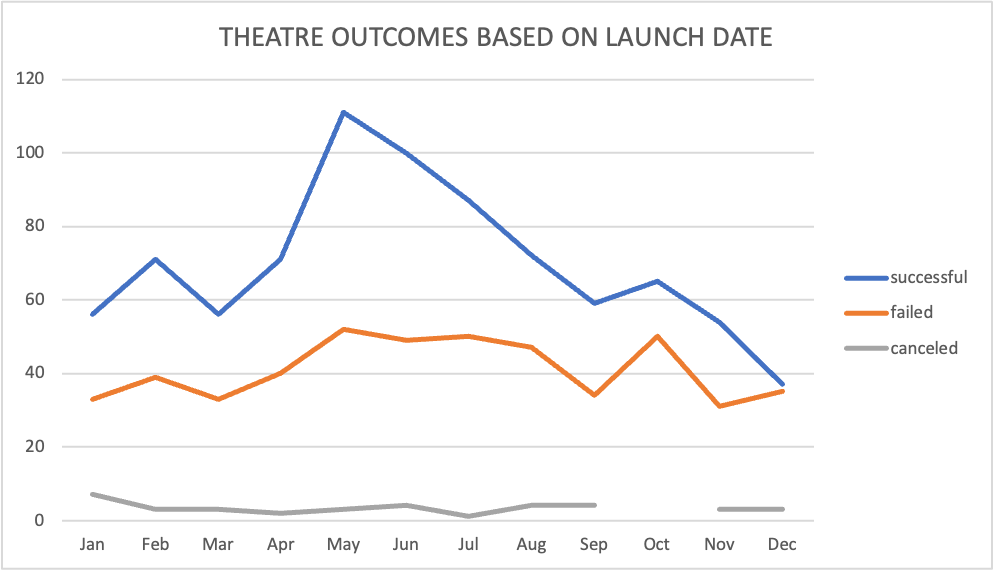
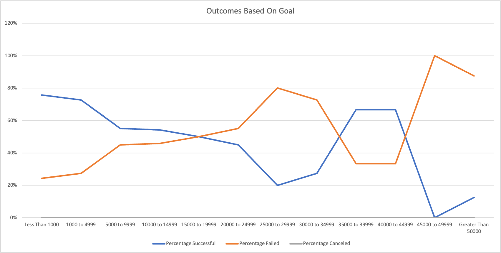

# Kickstarting with Excel

*Prepared for Louise - 2021 JAN 03*

## Overview of Project

### Purpose

* The main purpose of this analysis is to conduct a comparison of the outcomes for KickStarter Campaigns in the "Play" category, specifically, **launch dates** of the campaign and their respective **fundraising goals** will be visualized
* Additionally, limitations and futher analysis targets will be recommended

## Analysis and Challenges

### Analysis of Outcomes Based on Launch

A dataset consisting of **outcomes** and their respective **launch date** was analysed by understanding the amount of successful, canceled, and failed outcomes that were launched during each month. The following graph was produced to help visualize the findings expressed in percentage:

*Please note that for the month of **October** there were **no canceled plays**, and therefore there is a gap in the line graph*

### Analysis of Outcomes Based on Goals

A dataset consisting of **outcomes** and their respective **goal** was analysed by understanding the amount of successful, canceled, and failed outcomes that were launched with a spaecifc target range. The following chart was produced to help visualize the findings expressed in percentage:

*Please note that for the **entire dataset** there were **no canceled plays**, and therefore there is line present for this outcome*

### Challenges and Difficulties Encountered

Although no challenges or difficulties were encountered during this analysis, one thing to consider when performing 

## Results

- What are two conclusions you can draw about the Outcomes based on Launch Date?

* It is clear that 

* Limitations to keep in mind when reviewing the conclusions:
   - This dataset is obtained from *KickStarter* campaigns only, and other crowdfunding paltforms such as *GoFundMe, Indiegogo,* etc. were not consulted
   - This dataset consists of campaigns with the category *theatre* and subcategory *plays* and it is assumed that all plays utilized the appropriate labels at both the category and subcategory levels

- What are some other possible tables and/or graphs that we could create?
